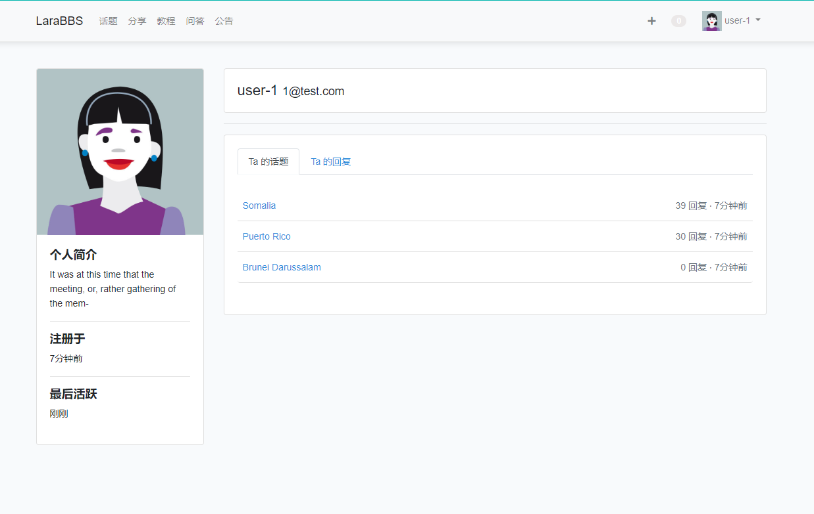
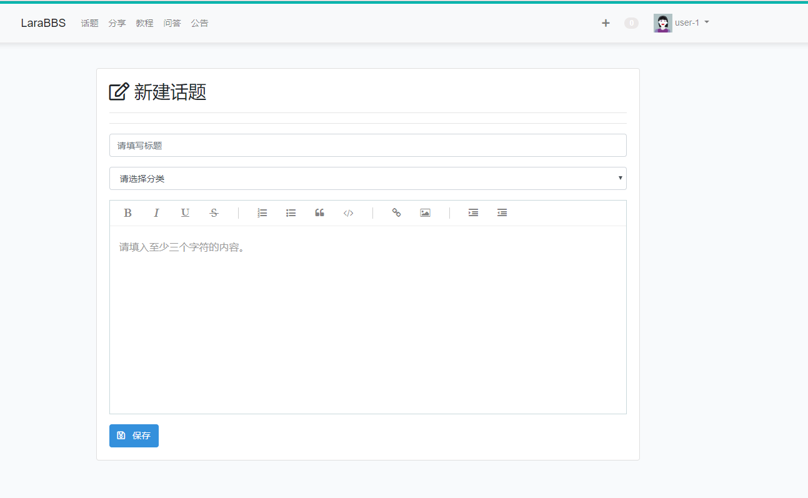
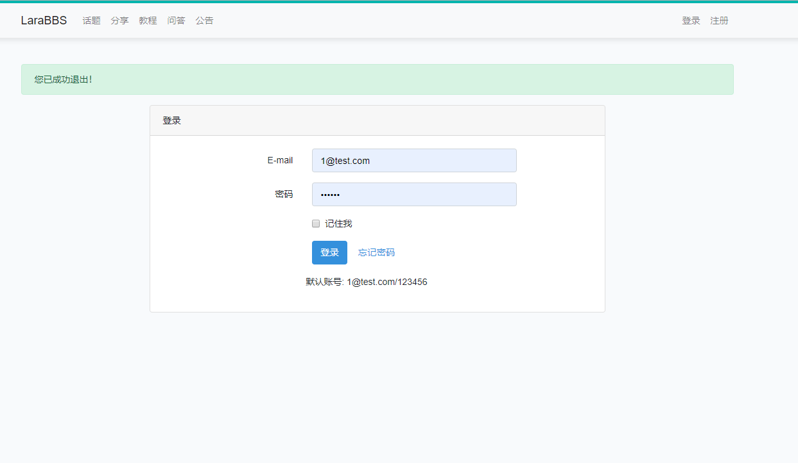
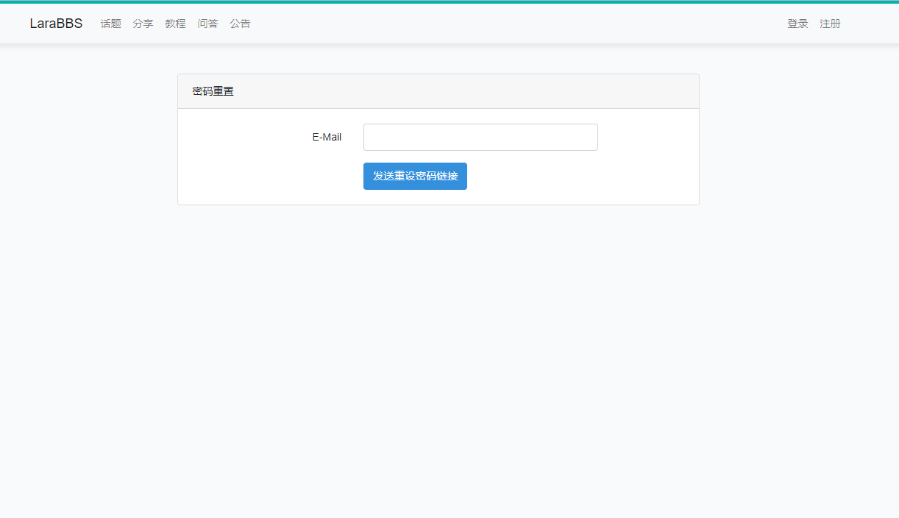
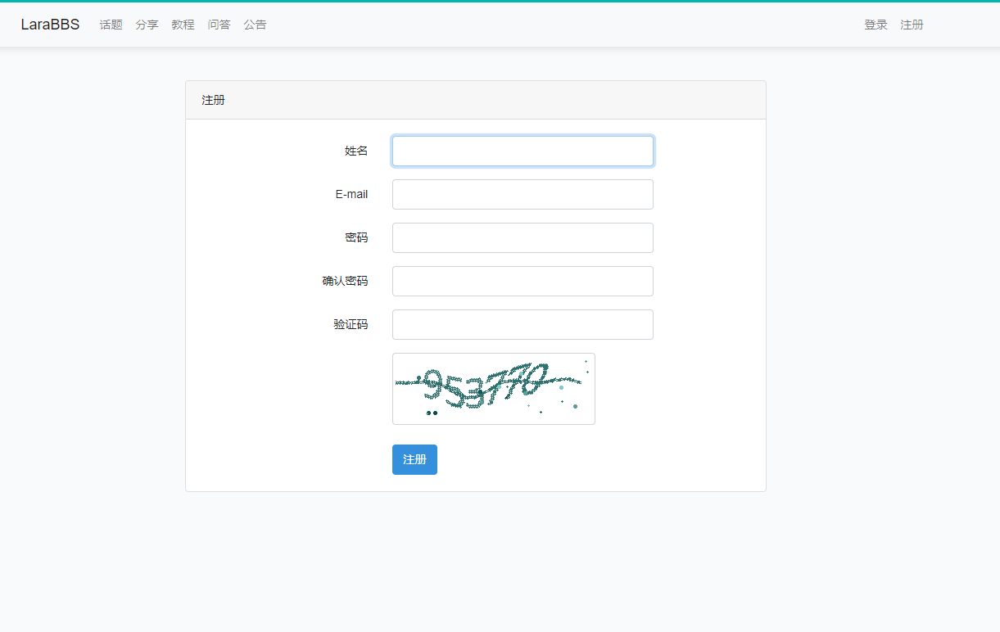

# Gin BBS App

- [访问地址](http://www.frontendgo.com:8889)

## 项目目录结构
<details>
<summary>展开查看</summary>
<pre><code>
├── app              项目核心逻辑代码
│    ├── controllers 控制器
│    ├── models      模型
│    ├── auth        用户相关
│    ├── cache       缓存
│    ├── cron        定时任务
│    ├── helpers     帮助方法
│    ├── policies    权限
│    ├── requests    参数验证
│    ├── services    复杂查询
│    └── viewmodels  数据转换
│
├── bootstrap        各组件初始化
│
├── config           配置中心
│
├── database         数据库
│    └── factory     数据 mock
│
├── pkg              项目依赖
│
├── public           项目静态文件
│
├── docs             swagger api doc
│
├── test             测试文件
│
├── resources        前端源码
│    └── view        go 模板文件
│
├── routes           路由
│    └── middleware  中间件
│    └── routes.go   路由注册
│    └── api.go      api 路由注册
│    └── web.go      页面路由注册
│
├── storage          存放日志等文件
│
├── main.go          项目入口
│
├── config.yaml      项目配置
│
├── deploy.sh        部署脚本
│
├── Makefile         Makefile 文件
│
├── vue-admin-app    vue 管理员后台前端源码
│
├── taro-app         taro web app 源码(小程序 ... 端)
│
└── flutter_app      flutter app 源码(Android iOS 端)
</code></pre>
</details>

## 启动
```
# 需先安装 fresh (https://github.com/gravityblast/fresh)
# go get github.com/pilu/fresh

# 启动前建议配置环境变量: GOPROXY=https://goproxy.io

cd gin_bbs
cp ./config.example.yaml ./config.yaml
make dev # 或者也可直接 fresh -c ./fresh.conf
# 项目相关命令参见 Makefile
```

数据库配置需要修改 `config.yaml`：
```
DB:
  CONNECTION: mysql
  HOST: 127.0.0.1
  PORT: 3306
  DATABASE: gin_bbs
  USERNAME: your_username
  PASSWORD: your_password
```
如果运行的是 debug 模式，数据库名应该为 `gin_bbs_debug`。

## 实现功能
- [x] CSRF 验证
- [x] flash 消息闪现
- [x] 记忆上次表单提交的数据
- [x] 参数校验模块
- [x] 命名路由
- [x] 分页
- [x] 发送邮件
- [x] 用户权限模块
- [x] 日志
- [x] 前端构建 (typescript、sass ...)
- [x] 验证码
- [x] pongo2 template
- [x] 文件上传
- [x] 发送短信
- [x] 微信登录
- [x] swagger api 文档
- [x] JWT (刷新、黑名单)
- [x] 接口测试
- [x] 推送
- [ ] vue 管理员后台系统
- [ ] taro web 移动端 (小程序 ... 端)
- [ ] flutter 移动端 app (Android iOS 端)


### 角色
角色的权限从低到高，高权限的用户将包含权限低的用户权限

- 游客 —— 没有登录的用户
- 用户 —— 注册用户，没有多余权限
- 管理员 —— 辅助超级管理员做社区内容管理
- 站长 —— 权限最高的用户角色

### 信息结构
- 用户 —— 模型名称 User，论坛为 UGC 产品，所有内容都围绕用户来进行
- 话题 —— 模型名称 Topic，LaraBBS 论坛应用的最核心数据，有时我们称为帖子
- 分类 —— 模型名称 Category，话题的分类，每一个话题必须对应一个分类，分类由管理员创建
- 回复 —— 模型名称 Reply，针对某个话题的讨论，一个话题下可以有多个回复

### 用例
#### 1. 游客
- 游客可以查看所有话题列表
- 游客可以查看某个分类下的所有话题列表
- 游客可以按照发布时间和最后回复时间进行话题列表排序
- 游客可以查看单个话题内容
- 游客可以查看话题的所有回复
- 游客可以通过注册按钮创建用户（用户注册，游客专属）
- 游客可以查看用户的个人页面

#### 2. 用户
- 用户可以在某个分类下发布话题
- 用户可以编辑自己发布的话题
- 用户可以删除自己发布的话题
- 用户可以回复所有话题
- 用户可以删除自己的回复
- 用户可以编辑自己的个人资料
- 用户可以接收话题新回复的通知

#### 3. 管理员
- 管理员可以访问后台
- 管理员可以编辑所有的话题
- 管理员可以删除所有的回复
- 管理员可以编辑分类

#### 4. 站长
- 站长可以编辑用户
- 站长可以删除用户
- 站长可以修改站点设置
- 站长可以删除分类

***












